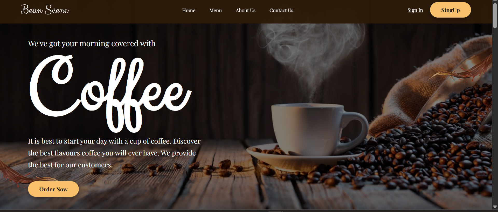
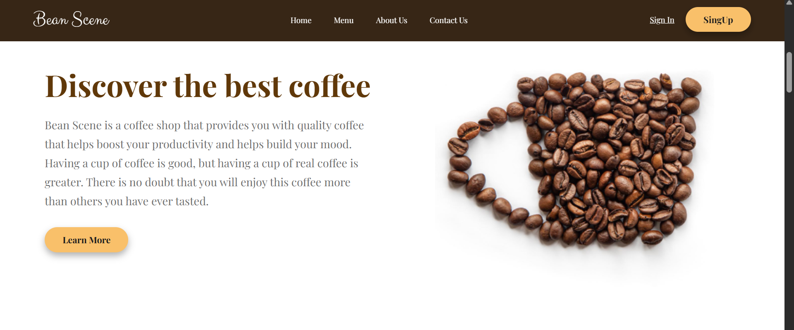
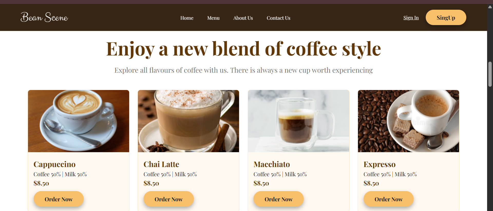
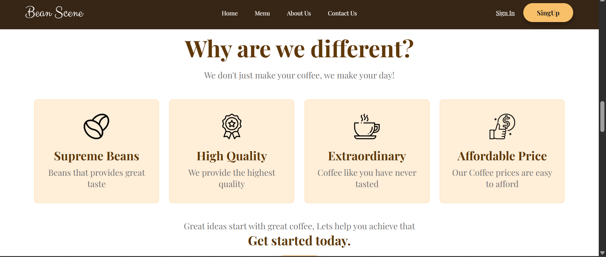
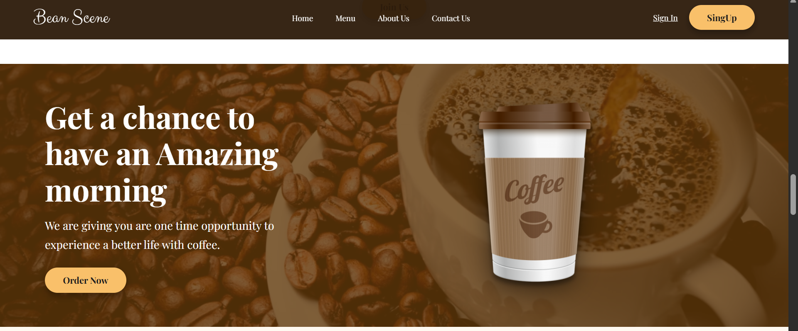
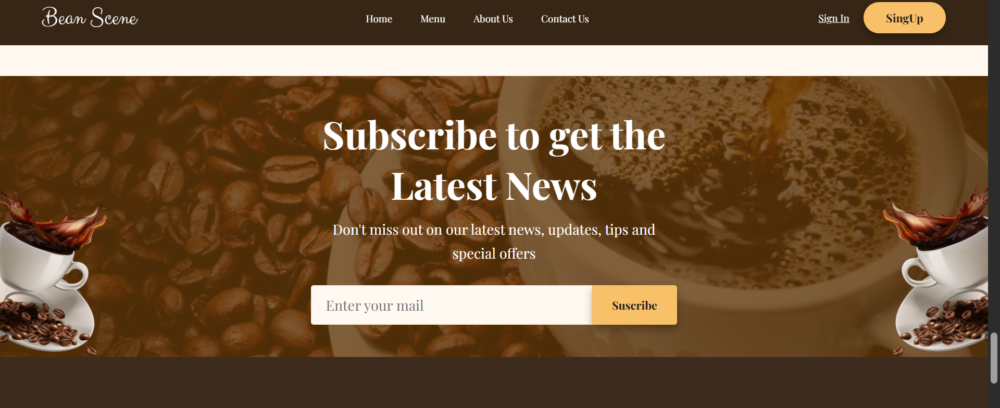
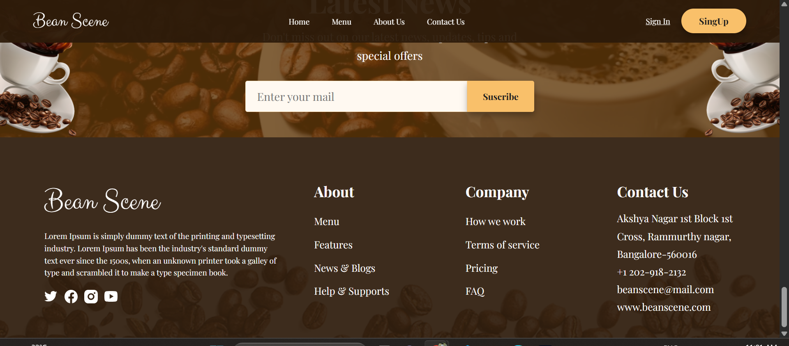

# ☕ Bean Scene — Coffee Website

A coffee shop landing page built with pure **HTML & CSS**. No frameworks, no build tools — just open and run.

---

## 📖 Overview

**Bean Scene** is a modern and elegant coffee shop landing page designed using only **HTML5** and **CSS3**. The project focuses on creating a clean, responsive, and visually appealing user interface while maintaining a simple project structure.

---

## ✨ Features

* ☕ Modern Coffee Shop UI
* 📱 Responsive Layout
* 🎨 Clean & Elegant Design
* 🧭 Sticky Navigation Bar
* 🍵 Coffee Menu Cards
* ⭐ Why Choose Us Section
* 💬 Customer Testimonials
* 📧 Newsletter Subscription
* 📍 Informative Footer
* 🚀 Pure HTML & CSS (No Frameworks)

---

## 📁 Project Structure

```text
bean-scene/
├── index.html
├── styles.css
└── images/
```

---

## 🖥️ Sections

| # | Section        | Description                                                   |
| - | -------------- | ------------------------------------------------------------- |
| 1 | Navbar         | Fixed navigation with logo, links, Sign In & Sign Up          |
| 2 | Hero           | Full-screen banner with background image and Order Now button |
| 3 | Discover       | Two-column section with brand story and coffee image          |
| 4 | Menu           | 4 coffee cards — Cappuccino, Chai Latte, Macchiato, Espresso  |
| 5 | Why Us         | 4 feature cards highlighting what makes Bean Scene different  |
| 6 | Morning Banner | Promotional banner with overlay and coffee cup image          |
| 7 | Feedback       | Customer testimonial with quote, author photo & arrows        |
| 8 | Subscribe      | Email subscription form over a background image               |
| 9 | Footer         | Brand info, navigation links, company links & contact details |

---

## 🛠️ Tech Used

* HTML5
* CSS3
* Flexbox
* CSS Grid
* CSS Variables
* Google Fonts

  * Playfair Display
  * Clicker Script

---

## 🌐 Browser Support

* ✅ Google Chrome
* ✅ Microsoft Edge
* ✅ Mozilla Firefox
* ✅ Safari
* ✅ Opera

---

## 🚀 How to Run

1. Download or clone the project folder.
2. Make sure the `images/` folder is in the same directory as `index.html`.
3. Open `index.html` in any modern web browser.

No installation or build process is required.

---

## 🔮 Future Improvements

* Dark Mode Support
* Smooth Animations
* Enhanced Mobile Responsiveness
* Interactive JavaScript Features
* Backend Integration for Newsletter

---
## output

      


---
## 👨‍💻 Author

**Sahil Nerpagar**

---


## ☕ Crafted with ❤️ for Coffee Lovers

If you like this project, don't forget to **⭐ star the repository**!

